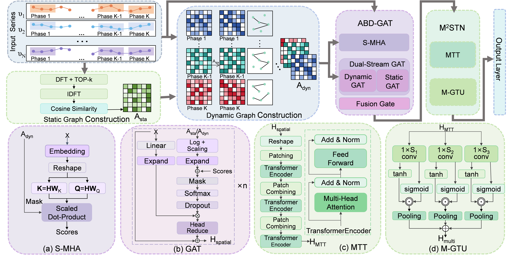

# ADGformer: Adaptive Dynamic Graph Transformer for Multivariate Time Series Forecasting

This repository contains the **core model architecture** of ADGformer.

> **Note:** The complete training pipeline, experiment scripts, and datasets will be released upon paper acceptance. Currently, only the model implementation is provided for reference.

## Overview

ADGformer tackles multivariate time series forecasting by adaptively learning dynamic inter-variable correlations and capturing multi-scale temporal dependencies. 



The model integrates four key components:


- **S-MHA (Spatial multi-head attention bias):** Computes spatial attention scores to guide message passing between variables.
- **Adaptive dual-stream GAT:** Performs spatial message passing on both dynamic and static graphs with S-MHA bias, fused via a learnable gating mechanism.
- **MTT (Multi-scale Temporal Transformer):** A hierarchical Transformer encoder with progressive patch merging to capture temporal dependencies at multiple scales.
- **GTU (Gated Temporal Unit):** Multi-kernel temporal convolution with gating for capturing temporal patterns at different receptive fields.


## Dependencies

einops==0.8.1
matplotlib==3.10.7
numpy==1.24.3
pandas==2.3.3
ptflops==0.7.5
scikit_learn==1.8.0
statsmodels==0.14.5
torch==2.6.0


## Datasets
The used datasets are available at:

ETT (4 subsets), Weather, Electricity and Exchange_rate https://github.com/thuml/iTransformer
Flight https://github.com/YoZhibo/MSGNet

Our newly released dataset, HTS-Wall, will be fully released to the public once the paper is accepted. We are now providing a sample dataset.

## License

This project is licensed under the MIT License.

## Citation

If you find this work helpful, please cite our paper:

```
@article{...}
```
